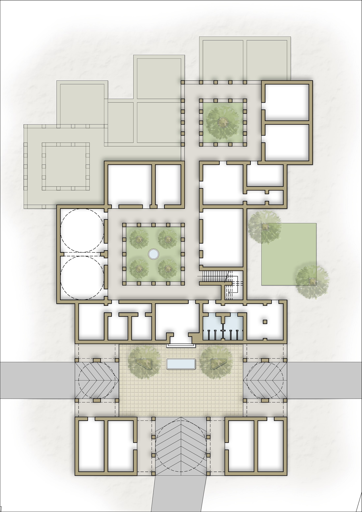
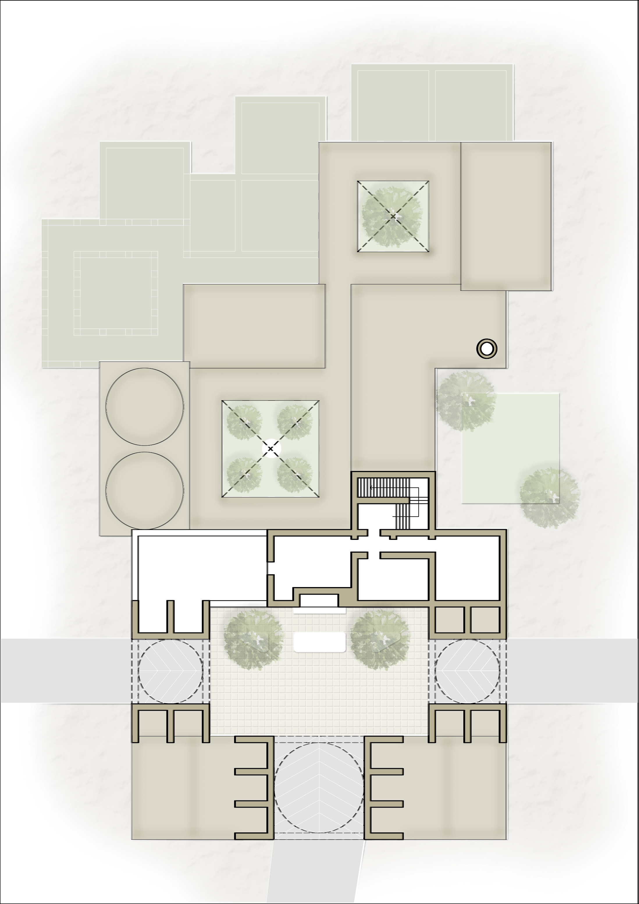
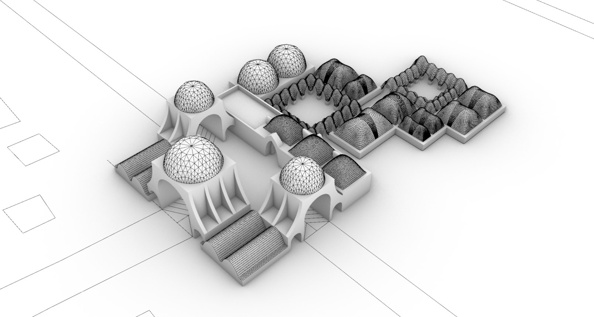
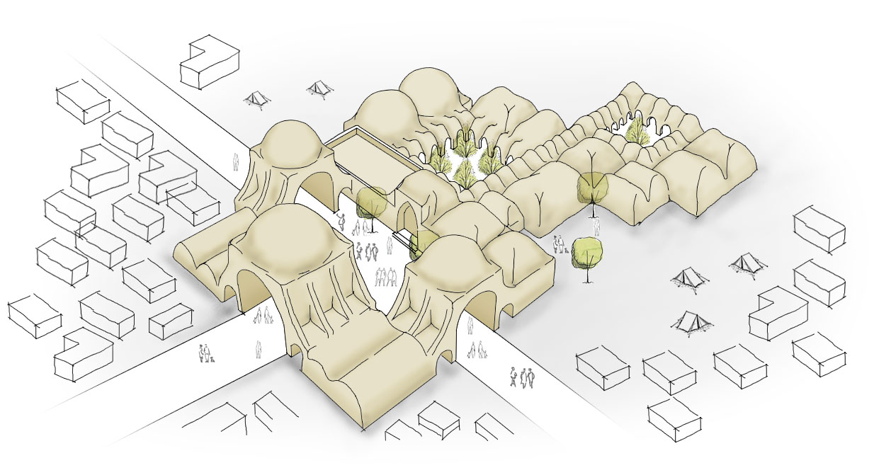

## Group 04 | Heritage Center
 

### **Phase 2**

The bubble diagram generated through Syntactic tool provided an idea of adjacencies and the connection of spaces. Having decided the site location, the analysis of the site was carried out to establish nodes and understand the circulation on site.

A set of rules were formed for the different spaces in terms of preferred orientation, connections, adjacencies  and room dimensions based on the chosen grid size. These rules served as the input for the kangaroo solver which generated different layout options for the floor plan. The final floor plan was chosen based on architectural intent and then post-processed manually which formed as a basis for moving forward with the shaping process. 

 

 

The final layout was divided into different roof typologies based on architectural intent and the function of the spaces. The roof forms were categorized into Nubian vaults, free-form domes and Muqarnas domes. The method for performing the dynamic relaxation process was then chosen based on the roof forms. Different tessellation patterns were designed and optimized to generate the meshes for the different spaces of the building. Having selected the final mesh, the roof was dynamically relaxed using the python script and the kangaroo solver method depending on the roof form.

 

 

 
 

### Group 4 Members:

- Barbara Foolen de Oliveira - 4484592
- Yamini Patidar - 5055288
- Inaka Sema - 5089557
- Maimuna Bala Shehu - 5117097
- Selina Bitting - 5004179