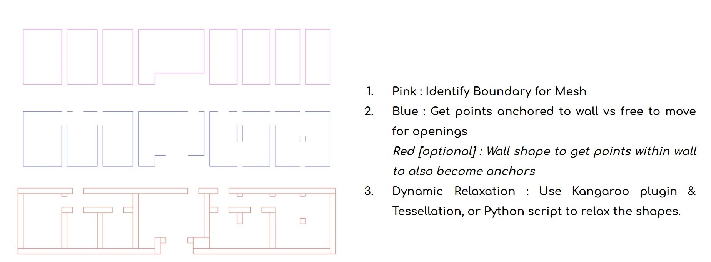

## Models
Within this folder al the 3D models and corresponding grasshopper files can be found. It is subdivided into configuration, final shape and al of the different rooftypologies.

 

**The different roof typologies**

The building roofs were categorized into different types based on the architectural intent as follow:
Free form domes - Workshops and Riwaqs
Nubian vaults - Shops
Muqarnas domes - Gateways and multipurpose hall
Nubian vault and domes - Double story structure

 

**How we approached the modeling of it**

The process was to first outline the shape which would be dynamically relaxed, then create linework of the edges of the walls to indicate where the openings are. An optional step was to use rectangles to select points within the walls, which had different effects on the form.

 

