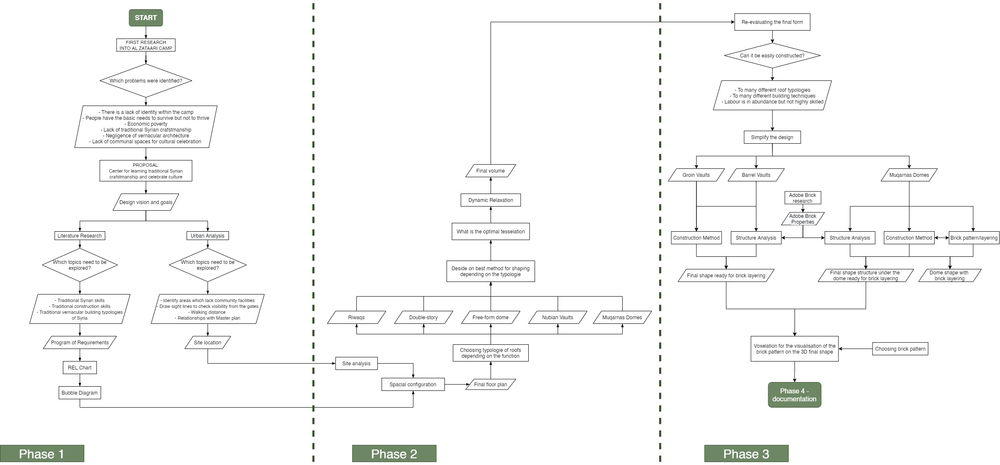

## Group 04 | Heritage Center
 

### **Phase 3**

After the mid-term presentation we re-evaluated our final shape. We did a evaluation in terms of constructability where we asked the question of how easily our building could be constructed. With our many different type of roof shapes and many different free form domes we came to realize that the design needed to be simplified in order to make it a feasible design. Within this simplification it was important to find a correct balance. The design needs to be striking enough to be called a heritage centre but not too difficult to construct. With this into consideration the design got groin vaults for most of the one story spaces, barrel vaults for the riqwas and the double story spaces and for the arched entrances and the multipurpose hall the domed muqarnas where kept.

 

 

 

To know which brick properties adobe had a research was done by using literature and the previous year’s brick testing results. These properties where used for the structural analysis which was done either on Karamba3D or Ansys. Together with the construction method the shape was finalized. 

### Group 4 Members:

- Barbara Foolen de Oliveira - 4484592
- Yamini Patidar - 5055288
- Inaka Sema - 5089557
- Maimuna Bala Shehu - 5117097
- Selina Bitting - 5004179