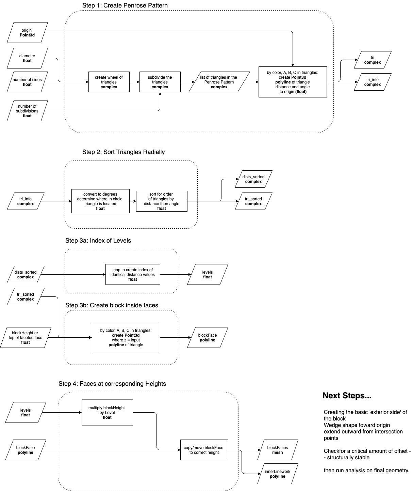

## Code & Flowchart

The muqarnas blocks for the dome are a WIP script. The simplest form of the current logic is:

### Create Pattern - Sort Triangles - Lift One Corner - Move to Vertical Block Location
 

___

 
A somewhat more in-depth version is the flowchart below:
 

For the literal construction information as well as structural studies for the domes themselves please see the product section of the repository. 

The python tool and geometries being studied in ANSYS are not yet the same, which will be addressed in the next stage of the project.