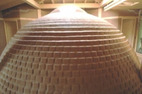
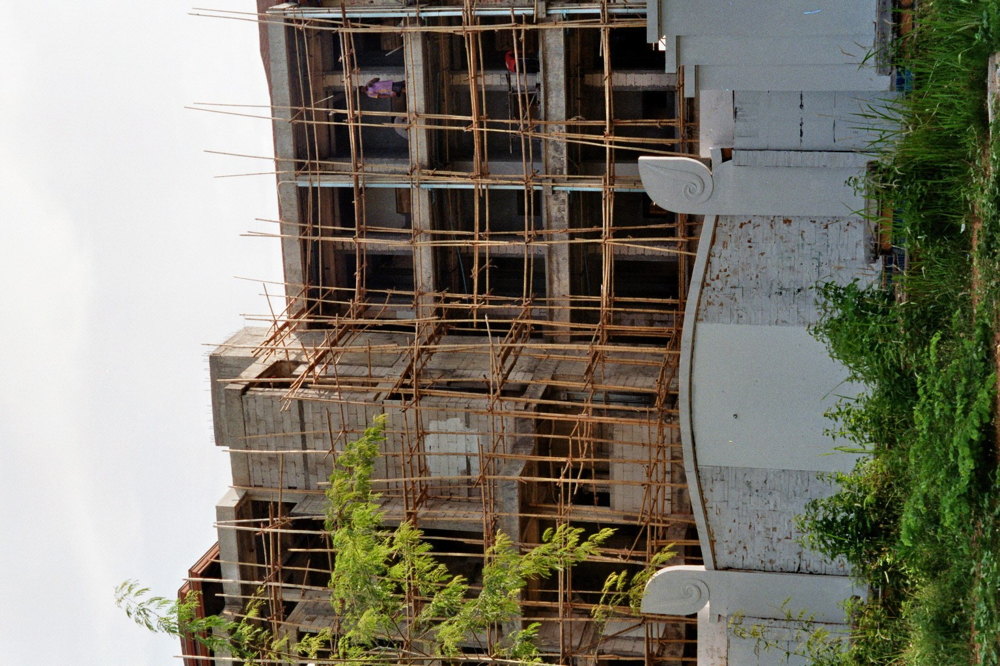

## Dome construction

To construct the dome first the base catenary curve is build with the same method as explained in the Workshop_construction folder. From there it is extended 2.4m to each of the 4 sides. After that the pendentive is created by filling in the space between the arches. To build the dome, bricks are laid step by step horizontally. And finally the dome is covered with a sand mixture to smoothen the edges and make it whether resistant. 

 
 

An example of a dome build with this method is the one in a residence in Rosdorf Germany.

 
 

The scaffolding will be created from bamboo or rest wood that can be found, just like they did over here in Thailand.

