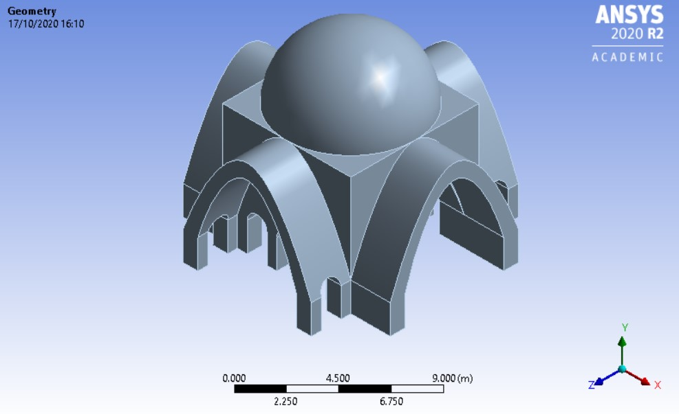
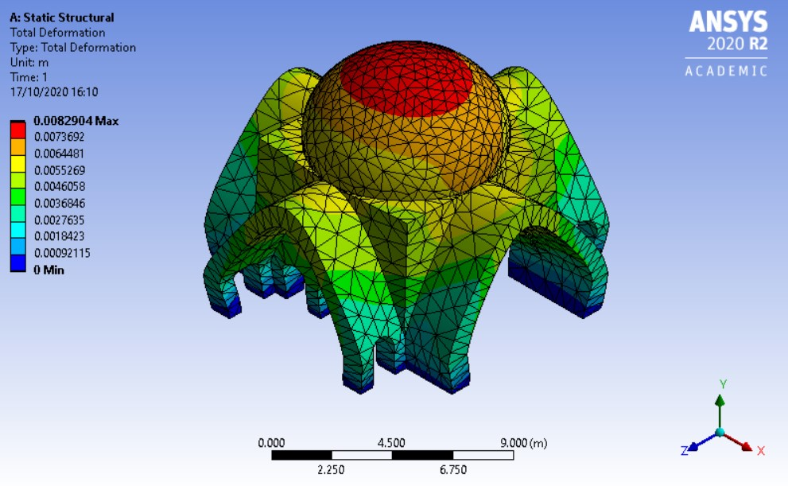
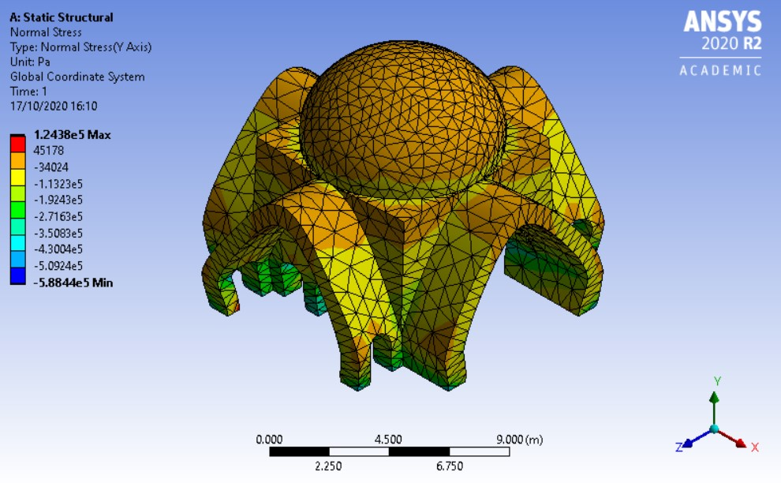
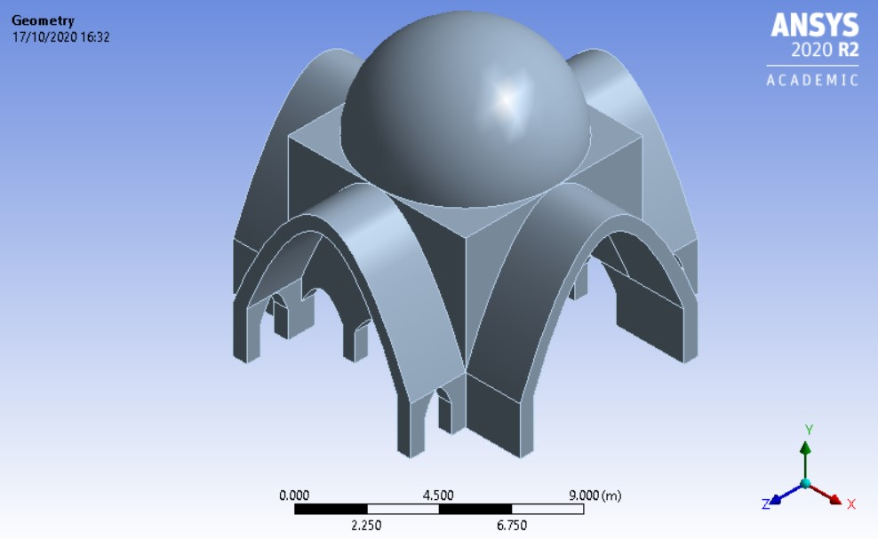
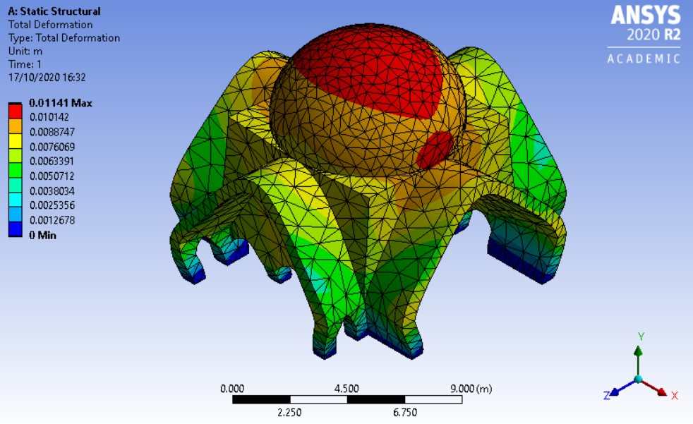
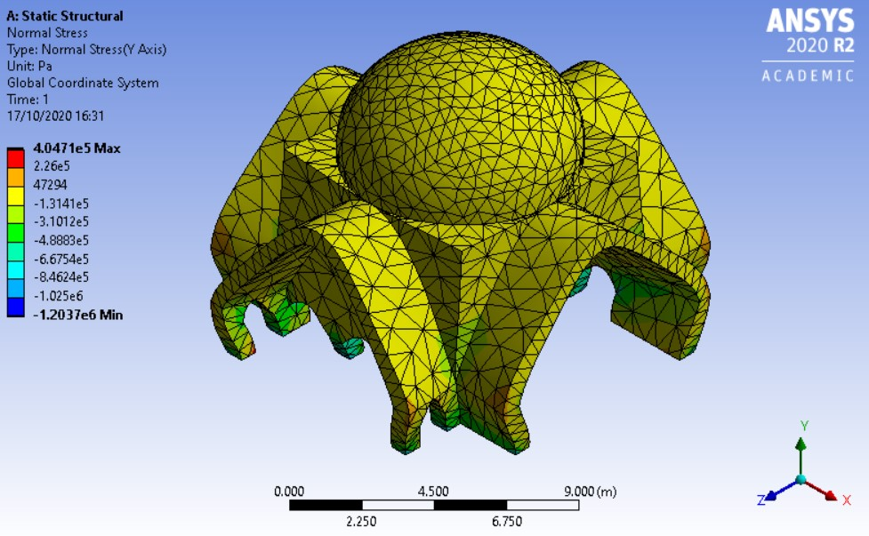

## Dome structure

To determine the optimal structure a first model was drafted in Ansys. This was a replica of what was previously designed. This was not structurally sound so with research into old structures similar to this one brought a few solutions. One was having tension ring, another option would be having catenary arches instead of round and a last thing that can improve the structure was having pendants holding the dome. We opted for the pendentives and the catenary curve only because the tension right did not fit quite right in terms of aesthetics. This was modelled and then two thicknesses where tested to see which was within the maximum allowable deflection = 16.5mm. 

 

The first one we tested was a structure with a thickness of 0.9m with a dome thickness of 0.3m. The result where quite good because the max deflection was 8.29mm, way under the maximum allowable deflection.

 
 

To see if we could still achieve good results but with lesser materials a structure with a thickness of 0.6m was tested. The dome thickness stayed the same. The maximum displacement was 11.41mm which is still within the allowable displacement. This is the one we finally choose.

 
 

One of the things we could not test was how pendentives would work in this model due to the difficulty it was to create that kind of shape. However we expect it to only improve the structure of the dome because it disperses the forces more evenly.

