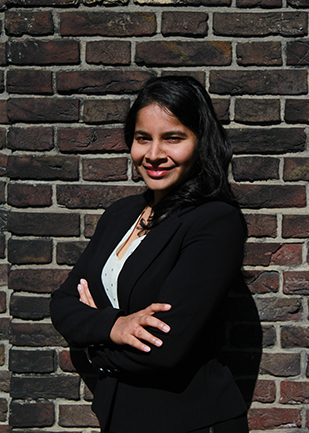
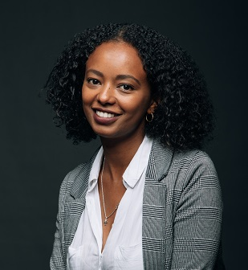
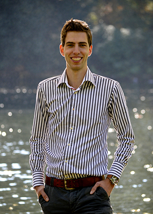
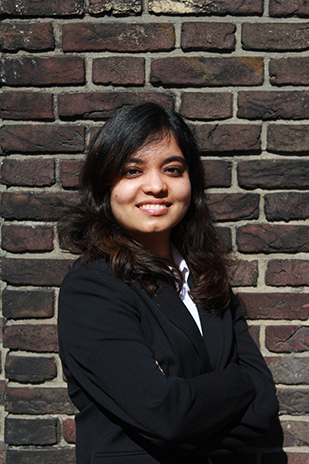

 
Raha is designed by a group of 5 enthusiastic students pursuing their masters education in Building Technology at the Technical University of Delft, The Netherlands. Their aligned motivation to further computational skills and its application in Architectural design/construction brought them together for this project.   

Want to know the team better? Please read through the introductions below. Want to start an interesting conversation or look for collaboration with them? Please contact them via Linkedin!   

**Anagha Yoganand** [Linkedin](https://www.linkedin.com/in/anagha-yoganand/)

  

 
Anagha Yoganand is currently pursuing MSc Architecture, Urbanism and Building sciences under the Building Technology track. She also chairs BouT, the study association of the AE&T department at the Bouwkunde. Her academic background in Architecture and two years of practice experience in India has helped her understand the technical details and implications of attaining sustainable designs that impact the overall performance of buildings. At TU Delft she is keen to specialize in computational design and product innovation with emphasis given to optimization and evaluation of design performance.  

**Bezawit Zerayacob Bekele** [Linkedin](https://www.linkedin.com/in/bezawit-zerayacob-bekele/)

  

 
Bezawit Zerayacob is a young architect with experience in research, design and construction industry. Currently, she is pursuing her Master's Education in Building Technology at the Delft University of Technology with a focus on facade, structural and computational design.  Bezawit is passionate about finding the intersection between design, technology and business to solve societal and environmental problems.  She is motivated to study appropriate building technology and use of local resources as a method for reducing the housing deficit in developing countries along with ideating strategies and computational design tools for slum upgrading in poverty-stricken urban areas. 

**Shriya Balakrishnan** [Linkedin](https://www.linkedin.com/in/shriyabalakrishnan/)

  

 
Aspiring to become a leading Building Technologist, she is a highly motivated, hardworking individual. After pursuing her bachelor's in architecture from Mumbai University, she worked as an Assistant Project Architect at SSA Architects in Mumbai for a year.
In view of widening her vistas beyond design and architecture, she was keen to pursue her masters in a technical subject which bridged the gap between an architect and an engineer. Pursuing her masters in Building Technology has helped her gain the necessary technical knowledge and improve her software skills. 

**Thijmen Pluimers** [Linkedin](https://www.linkedin.com/in/thijmenpluimers/)  

 
After doing his Bachelor at the Saxion hogeschool  in Enschede and having gained work experience Thijmen decided to come to Delft to enroll in the Building Technology master track.
Having focused his Bachelor graduation on structural engineering he was determined to focus on broadening his knowledge about the building industry during his master study. Previous to earthy he already gained knowledge about facades by following the Facade Design course and being a Facade designer in the interdisciplinary course MEGA. It was in this course where he saw the potential of computational design and wanted to learn about this. This naturally brought him to the earthy course.  

**Twinkle Nathani** [Linkedin](https://www.linkedin.com/in/twinkle-nathani-88036a105/)  

 
Twinkle is a student of master track Building Technology at TU Delft. She is also the head of Media and Public Relations committee of BouT, the study association of the AE&T department at the Bouwkunde. Over the past years, she had a growing interest in the field of sustainable design. After graduating in architecture from National Institute of Technology in 2018, she worked for two years with firms specializing in earth construction and bio-climatic building design. She decided to take up this course to apply and further enhance her knowledge in the design and construction of Earthy buildings through computational workflows.

