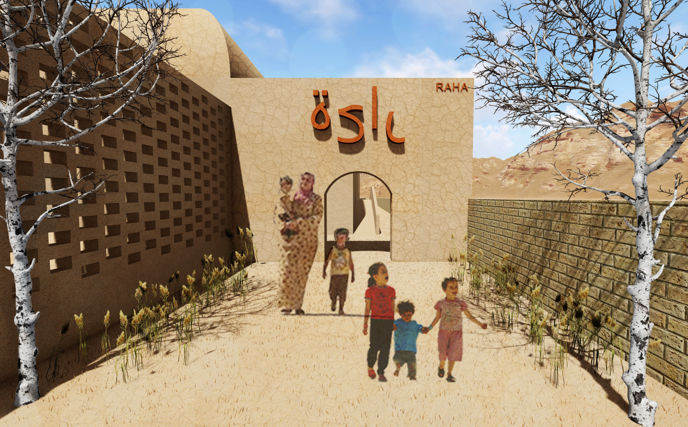

# RAHA[.](https://www.youtube.com/watch?v=D-GP-sk8IJo)

*Fig: 3D Visualisation of the Entrance of RAHA*

 
Welcome to our website. This website will show all our progress within the course of Earthy. Using this website allows us to use gifs and videos to explain our design and make it easier to navigate. The menu bar consists of different links that take you through the entire design process from analyzing the problems to the constructibility of the project.  

## Abstract

 
The aim of the design project 'Raha' is to provide a recreational space for the distressed Syrian refugees in the Al Zaatari camp, Jordon, built using locally available material, i,e adobe, by the local inhabitants. Therefore, the design strives to adapt for ease of construction with these fixed boundary conditions. In order to achieve this, computational tools such as Grasshopper and Python were explored with manual evaluation of resulting outcomes. A generative design methodology is adopted that results in a coherent configuration, formation, structure and construction methodology of spaces.   

