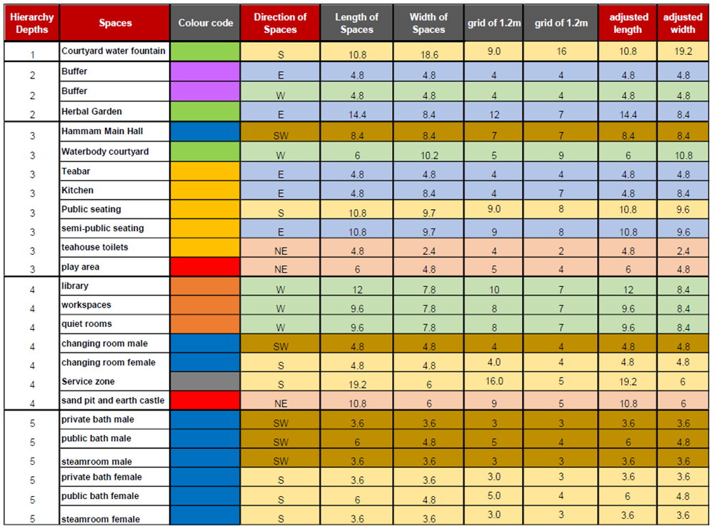

## 0_Acknowledgements  

The achievements in this project would not have made if it was not for the course guides. They helped us gain knowledge and point us in the right direction. Also, the achievements of previous years were of great inspiration. We hereby thank all of them.

---  
## 0_Literature

### Vernacular Architecture

To see how houses are typically built in Jordan and to decide if inspiration could be taken from this a study into their vernacular architecture was conducted. A small summary can be read below.

  

In Jordan, there is a separation between three different vernacular architecture styles which are all rarely seen as a result of inhabitants looking for better living conditions in the cities thus abandoning the buildings. All have to do with the different regions in the country namely: The desert, The highlands and the valley.

Traditionally the houses used in the dessert are tents, houses in the highlands are simple rectangular houses subdivided into rooms by using an arched wall. 
The valley houses seem to be the most luxurious of the tree having several rooms and a courtyard or patio. (Baglioni, E. ,2015)

### Configuration

**References**  

- Baglioni, E. (2015). Jordanian vernacular architecture. Taylor & Francis Group, London.

- Türkmen, İ., Ekinci, E., Kantarcı, F., & Sarıcı, T. (2020). The mechanical and physical properties of unfired earth bricks stabilized with gypsum and Elazığ Ferrochrome slag. Retrieved 2 November 2020

- Brown, P., & Clifton, J. (1978). Adobe. I: The Properties of Adobe. Studies In Conservation, 23(4), 139. doi: 10.2307/1505842

- Zangana, L., & Tokmachy, A. (2019). Study of the Thermal Insulation Properties of the Compressed Earth Block Stabilized with Gypsum. Kirkuk University Journal-Scientific Studies, 14(1), 241-251. doi: 10.32894/kujss.2019.14.1.16

- Nabavi.F, & Ahmed.E. (2016). Is there any geometrical golden ratio in traditional Iranian Courtyard houses. International Journal of Architectural Research: Archnet-IJAR, doi:http://archnet-ijar.net/index.php/IJAR/article/view/744

- Yadav, N., 2020. Interlocking Vaults By Voronoi Decomposition Of 3D Space. [online] Researchgate. Available at: <https://www.researchgate.net/publication/341977545_Interlocking_Vaults_by_Voronoi_Decomposition_of_3D_Space> [Accessed 3 November 2020].

- 2020, TRASH TALK. OXFAM. (https://oxfamilibrary.openrepository.com/bitstream/handle/10546/620329/dp-trash-talk-zaatari-recycling-210817-en.pdf;jsessionid=0AE54A9EFC7F9B03F399258EAF73F744?sequence=1) [Accessed 3 Novermber 2020]

---

## 1_Scripts

The design process, as shown on the design page, was developed using many grasshopper scripts. Below we listed the most important scrips with a download link for detailed study of the project.

**Site selector**
  
*Fig: Shows the site selection flow chart*

 
As per the proposed intervention of building a recreation hub, the main programmatic functions are a tea house, a hammam, a quiet space with a library, and a play area for children with connecting courtyards housing herbal gardens and water bodies.  To select the site the points of consideration are unbuilt spaces, water resources, proximity to other facilities such as schools and kindergartens and the distance from the main road. As the recreation hub includes a hammam, locating it near a water resource is essential. The recreation hub also includes a quiet space with library, a children’s playground which can be an extension to existing schools, youth centers and kindergartens. 

[Click here to download the script](rev/scripts/Location_finder.gh)  

**Bubble diagram maker**  

To optimize the use of the syntactic tool a grasshopper script was made that takes in the information of the REL chart and processes it into dots and lines for the syntactic tool to work with.

  
*Fig: Dots and lines generated by the output of the REL chart, this will be input for the syntactic tool.*

  
*Fig: The script is used for generating the lines between the dots, based on the value implied in the REL chart.*  

The excel can be [downloaded here](rev\scripts\Wellness_Centre_requirements.xlsx)  
The grasshopper tool can be [downloaded here](rev\scripts\Basic_bubble_diagram.gh)

**Gradient descent**

[The excel can be downloaded here.](rev\scripts\Space_layout_excel.xlsx)

  
*Fig: Spatial parameters translated as inputs into an excel sheet for the gradient descent tool*

The animation below shows the spatial configuration result of this computational process. The script can be [download here.](rev\scripts\Final_GradientDescentTool_.gh)  

  
    
**Relaxer**  

To study our tessellations and their final form a grasshopper script was made that did the relaxing.
It takes in anchor curves and the tesselation as input. After meshing the tesselation it relaxes it.
The script is illustrated in the gif below and can be downloaded below. 

[download here.](rev\scripts\tesselation_relaxer.gh)

  
*Fig: showing the process of relaxing the roof using grasshopper*

**Structural calculations**

The script comprises two stages: the first stage includes the analysis of the roof and the second stage includes the analysis of the walls. Additionally, python was used to check the weakest points of the analyzed geometry and generate a new color code for the areas which are not within the set limit states.

 

[download here.](rev\scripts\Structural_analysis_group2.gh)

**Rib maker**  

This script was designed to make all the ribbed roofs for the project.
The only inputs it needs are the brick sizes and the curves over which it needs to place these bricks.
the gif below illustrates how the ribs are generated. The script can be downloaded below.

[download here.](rev\scripts\Rib_brickgen.gh)

  
*Fig: Showing the process followed by the rib maker gif*

**Adobe 2.0 dome maker**

The script was designed for generating the the Adobe 2.0 geometry and brick laying.  
The inputs for this script are the diameter of the dome, the number of segments, squinch height and brick height.  

  
*Fig: Shows the computational tool generation in steps for creating Adobe 2.0*

[The script can be downloaded here.](rev\scripts\FInal_Adobe2.0.gh)